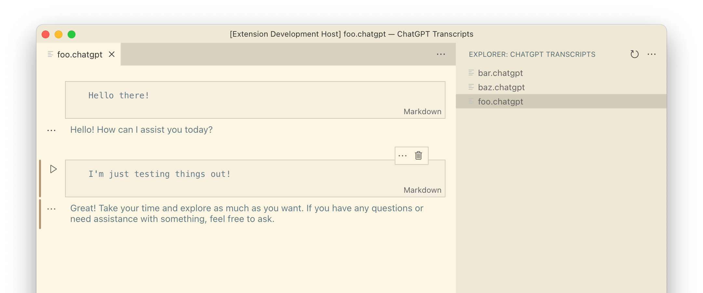

# ChatGPT Notebooks for VSCode

Welcome to the unofficial ChatGPT engine for VSCode Notebooks!

* Create a `.chatgpt` file to get started
* Use "Code" cells to enter your prompts.
* The execute cell function will send the conversation up to that point to the OpenAI API.
* You can choose your model in settings (default GPT-4).

## UI Suggestions

Many parts of the default notebook UI do not apply to a ChatGPT conversation. The author suggests hiding the notebook toolbar & all cell toolbar buttons besides delete. Increasing the Notebook Output Font Size is also recommended.

## Code/Markdown Cell vs Markdown Language

VSCode notebooks have two types of cells: Code and Markdown.

Code cells can be executed (i.e. sent to the API), Markdown cells cannot.

Within a Code cell, any type of language can be selected for syntax highlighting. *One of them is Markdown, which this extension uses, so that you can mix text and syntax highlighted code in your prompts.*

## Things to Avoid

The following operations will lead to undefined or unwanted behavior.
* Run All - It will send a request for every cell. Execute the last cell instead.
* Editing cells besides the last - Breaks the conversation flow.
* Re-ordering cells - Ditto.
* Long-running conversations - Results suffer & requests get larger.

## Understanding how the ChatGPT API works

The entire transcript of your conversation is sent to the API on each request. The OpenAI API does not store anything server-side. As your conversations get longer, your requests get larger. Keep this in mind when budgeting your API tokens. Try to create new conversations as frequently as possible - this also helps prevent hallucinations.
